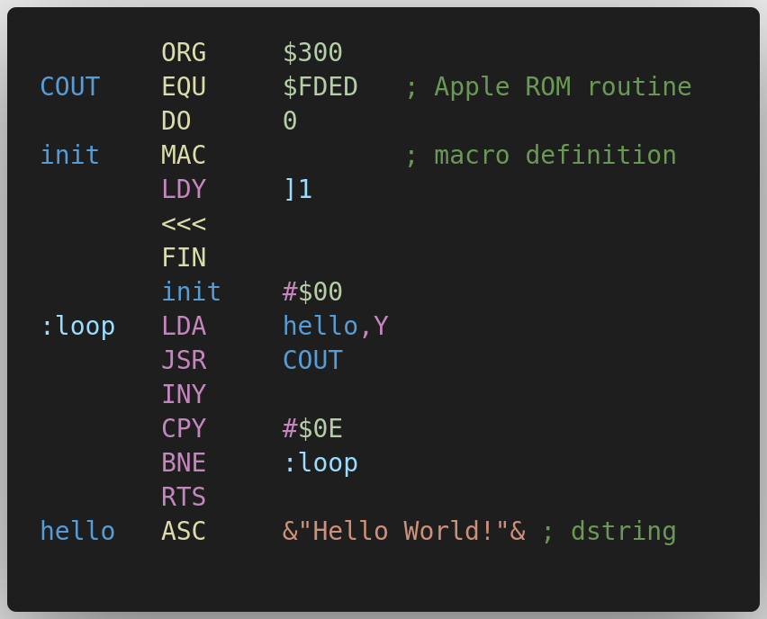

# Merlin 6502

Language support for Merlin 8/16 assembly language for the 6502 family of processors in Visual Studio Code, with extras for Apple II.

If you are using Merlin 32, syntactic distinctions to be aware of are covered [here](https://brutaldeluxe.fr/products/crossdevtools/merlin/).

* Semantic highlights true to Merlin 8/16 syntax
* Completions and hovers for all operations and pseudo-operations
* Completions and hovers for Apple II soft switches, ROM routines, etc.
* Diagnostics to identify errors and gotchas
* Options : see `Ctrl+Comma` -> `Extensions` -> `Merlin 6502`
* Commands: see `Ctrl+P` -> `merlin6502`
* Activates for file extensions `.asm`, `.S`

## Apple ][ Special Addresses

The extension knows hundreds of special address locations relevant to Integer BASIC, Applesoft, DOS 3.3, ProDOS, and the Apple ][ ROM.  Hovering over a literal address will display information about any address in the database.  Completions for special addresses are triggered when `$` is entered in the operand column following `EQU`.

## Using with Emulators

Before pasting your source code into emulators with clipboard support, run the ``format for copy and paste`` command.  This will create a new document with the correct formatting, i.e., exactly one space between columns.

## Merlin 8/16 Syntax

The aim is to emulate Merlin syntax exactly. As of this writing, the following are known exceptions:

* Operations with trailing characters are parsed as macro calls, e.g., `LDA:` is parsed as a macro
* All delimited strings ("dstrings") must be terminated
* Semicolons cannot be used in any label
* The opening bracket `[` cannot be used in any label
* The closing bracket `]` cannot be used in any label, other than as the leading character in a variable
