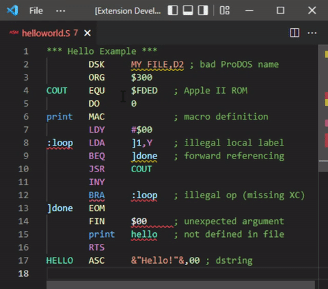

# Merlin 6502

Language support for Merlin 8/16/16+/32 assembly language for the 6502 family of processors in Visual Studio Code, with extras for Apple II.

*latest update*: more accurate handling of macro arguments

* Conforms to choice of Merlin version and processor target
* Resolves labels across project workspace
* Comprehensive highlights, completions, and hovers
* Completions and hovers for Apple II soft switches, ROM routines, etc.
* Insert disassembly from emulator memory and disk images
* Transfer source code to and from emulators and disk images
* Diagnostics to identify errors and gotchas
* Options : see `Ctrl+Comma` -> `Extensions` -> `Merlin 6502`
* Commands: see `Ctrl+P` -> `merlin6502`
* Activates for file extensions `.asm`, `.S`

## Merlin Syntax Settings

Use extension settings (`Ctrl+Comma`, `Extensions`, `merlin6502`) to select the Merlin version.  This allows the extension to provide targeted diagnostics and completions.

There are a few syntax rules that are *always* enforced by the extension, and which may be more restrictive than a given Merlin version:

* All delimited strings ("dstrings") must be terminated
* The characters `;[{}<>=` cannot be used in any label
* The character `]` cannot be used in any label, except to start a variable

## About Columns and Case

Assembly language is organized into lines and columns.  Merlin source files use a single space as the column separator, even though the Merlin editor displays columns at tab stops.  This extension will accept any combination of spaces and tabs as the column separator.  The use of flexible column separators means that if some columns are empty, context-free counting of columns is not possible.  Since the parser understands context this causes no trouble.  Formatting columns can be done in three ways:

* **on tab**: Setting the indentation (`Ctrl+P` -> `Indent Using ...`) to 8 is a fair choice if you want to use tabs for column positioning.

* **on space**: If you activate `Text Editor` -> `Formatting` -> `Format On Type`, then upon typing a space, the extension will advance the cursor to the variable tab stops that are defined in extension settings.  Note the formatting in this mode only works in the forward direction.

* **on command**: Using `Format Document` or `Format Selection`, will apply the variable column widths defined in extension settings.

Merlin labels are case sensitive, while instruction and pseudo-instruction mnemonics are not.  There are settings to control the behavior of completions and diagnostics with respect to case.  When pasting code into Merlin, auto-capitalization settings within Merlin may take effect.

## Working with Labels

You can use `Go to Declaration`, `Go to Definition`, `Go to References`, and `Rename Symbol` to find and manipulate labels.  You can also jump to labels using `Ctrl+O` (symbol in document), or `Ctrl+t` (entry labels throughout workspace).  Renaming is scoped to a document and its `PUT` and `USE` includes.

Headings (`*` comments) placed on lines immediately before a label definition are considered docstrings and become part of the hover for that label.  Markdown can be used in the docstrings.

## Apple ][ Special Addresses

The extension knows hundreds of special address locations relevant to Integer BASIC, Applesoft, DOS 3.3, ProDOS, and the Apple ][ ROM.  Hovering over a literal address will display information about any address in the database.  Completions for special addresses are triggered when `$` is entered in the operand column following `EQU` or `=`.

## Linker Command Files

Merlin linker command files are very similar to source files.  The extension will try to detect linker command files, and treat them specially.  As of this writing, the special treatment is simply turning off certain language services.  The detection threshold for linker commands can be adjusted in settings.

## Linker Modules

The extension will verify that `EXT` and `EXD` labels are declared as `ENT` in another module.  It does not analyze linker command files for consistency, it only verifies that the external label has at least one corresponding entry label *somewhere* in the project.  Hovering over the external label shows the corresponding entries.

## PUT and USE files

The extension will fully analyze `PUT` and `USE` includes, assuming it can find the referenced files.  The way the file search works is as follows.  The referenced file in column 3 is assumed to be a ProDOS pathname. The filename is extracted, and a search in the project workspace is carried out for a `.S` file with the same name.  The first match is analyzed.  The following should be noted:

* The ProDOS path and the VS Code project path do not need to match in any way
* If more than one file match is found, the extension will flag it as an error
* The file extension should *not* be included in the pseudo-op argument

When editing an include, the master file that defines the context is shown in the lower toolbar.  Clicking on the indicator allows the user to select a different context if applicable, i.e., if the include appears in more than one file.

## Processor target and the XC pseudo-operation

In the spirit of the original Merlin, we rely on the `XC` pseudo-operation to enable or disable the various operations and addressing modes associated with the different processor variants. The rules depend on the Merlin version:

* Merlin 8
    - Default target = 6502
    - `XC` sets target = 65C02
    - `XC` twice sets target = 65802
* Merlin 16/16+/32
    - Default target = 65816
    - `XC OFF` sets target = 6502
    - `XC OFF` followed by `XC` sets target = 65C02

However, note that `XC OFF` was not introduced until Merlin 16+.  The Merlin 32 assembler appears to ignore `XC`, but you can still use it in the extension for diagnostic purposes.

## Using with AppleWin

You can transfer code to and from the [AppleWin](https://github.com/AppleWin/AppleWin) emulator.

* Transfer source to Merlin
    - Format the source using `Ctrl+P` to select `merlin6502: Format for copy and paste into Merlin 8`
    - Use the emulator's clipboard functionality to paste the formatted code directly into the Merlin editor
* Insert Disassembly from emulator
    - From [AppleWin](https://github.com/AppleWin/AppleWin), create a save state file by pressing `F11`
    - Return to VS Code, position the cursor at the insertion point, and use `Ctrl+P` to select `merlin6502: Insert from AppleWin save state`
    - Select `Disassembly` and respond to the subsequent prompts
    - Select the save state file
* Insert Merlin Source
    - Open the source file in Merlin and create a save state file by pressing `F11`
    - Return to VS Code, position the cursor at the insertion point, and use `Ctrl+P` to select `merlin6502: Insert from AppleWin save state`
    - Select `Merlin Source`
    - Select the save state file

Operations with the state file are the same on any platform, but [AppleWin](https://github.com/AppleWin/AppleWin) itself is native to Windows.  Note that [AppleWin](https://github.com/AppleWin/AppleWin) is not part of the extension, and must be installed separately.

## Using with Virtual ][

You can transfer code to and from the [Virtual \]\ emulator.

* Transfer source to Merlin
    - Format the source using `Cmd+P` to select `merlin6502: Format for copy and paste into Merlin 8`
    - Use the emulator's clipboard functionality to paste the formatted code directly into the Merlin editor
* Insert Disassembly
    - Put the emulator in the desired state and leave it running
    - Return to VS Code, position the cursor at the insertion point, and use `Cmd+P` to select `merlin6502: Insert from Virtual ][ front machine`
    - Select `Disassembly` and respond to the subsequent prompts
* Insert Merlin Source
    - Open the source file in Merlin and leave the emulator running
    - Return to VS Code, position the cursor at the insertion point, and use `Cmd+P` to select `merlin6502: Insert from Virtual ][ front machine`
    - Select `Merlin Source`

This capability only applies to MacOS. Note that [Virtual \]\ is not part of the extension, and must be installed separately.

## Using with Disk Images

You can access files on a disk image.  In order to do this you must install `a2kit`.  If you have `cargo`, use the terminal to run `cargo install a2kit`, otherwise you can [download an executable](https://github.com/dfgordon/a2kit/releases), taking care to put it in your terminal's path.  As of this writing, the supported image types are `woz`, `dsk`, `do`, `po`, `d13`, `nib`, and `2mg`, assuming the latest `a2kit` is installed.

* `merlin6502: Insert from disk image`: brings up a file selector allowing you to choose an image file.  Once done, use the mini-menu to traverse the image's directory tree (if applicable) and select either a `TXT` or `BIN` file.  If a `TXT` file is selected it will be decoded as Merlin source and inserted. If a `BIN` file is selected, respond to the disassembly prompts, after which the disassembly is inserted.

* `merlin6502: Save to disk image`: After choosing the image file, use the mini-menu to traverse the image's directory tree (if applicable) and select a directory (`.` selects the current level).  Enter the name that the saved file will be given on the disk image.  If the file already exists you must respond to a warning.  The saved file will be encoded as a Merlin source file.

## Troubleshooting Tips

* VS Code
    - the language server has trouble with untitled documents; when creating a new document save it early
    - when entering hexadecimal into *editor* commands, use the modern convention, e.g. use `0xff` rather than `$ff`.
    - tab your way to the end of snippets
    - to mitigate diagnostic delay, break large source files into smaller modules
    - if symbol information doesn't load try forcing a diagnostic update
* Disk Images
    - update a2kit from time to time
    - Do not write to disk images while they are mounted in an emulator
* Disassembly
    - verify that the starting address is aligned with an instruction opcode
    - stop disassembly before start of data
    - adjust handling of BRK instruction in settings
* Merlin
    - restore the configuration defaults, especially memory banks
    - use the 128K version of Merlin 8
